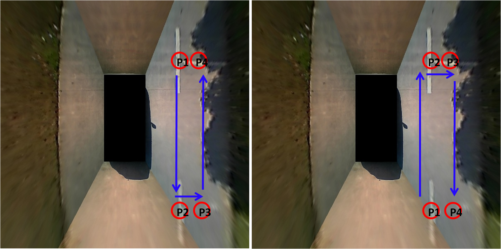
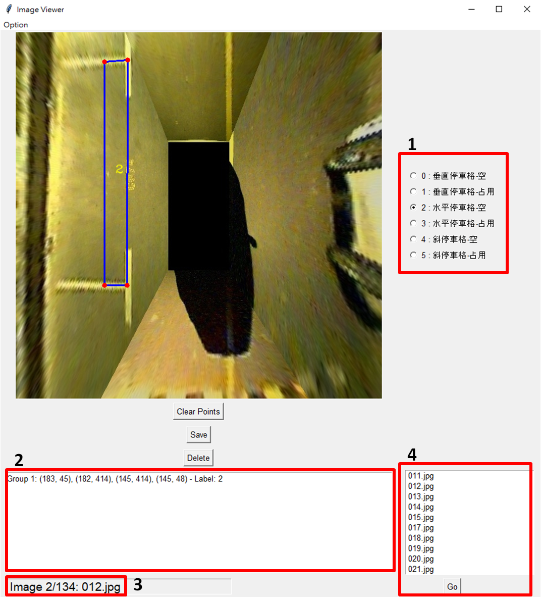

# Parking_Slot_Mark_Tool

<!-- -->

<!--https://github.com/user-attachments/assets/8fe7b55f-0fa4-4076-b238-f3d1d3cd8608-->

## Introduction
This is python GUI tool for marking parking lot point. Based on: [MarkToolForParkingLotPoint](https://github.com/Teoge/MarkToolForParkingLotPoint)

## Requirements
### Dependencies
* Python 3.5+
* tkinter
* Pillow
* Opencv

## How To Use
### 1. Prepare images
Place all images in a folder.

### 2. Read images
  1. Click **"Open folder"** in the **"Option"** in the upper right corner of the interface.

### 3.Mark Parking Slots
Each slot need **4** points, and the following images shows an example of the order of the markers.
  1. Click **left mouse** button once to mark the location junction points, such as P1 and P2.
  2. Click clockwise or counterclockwise, but note that **the junction points must be clicked first**.

  
  3. Select the category of the parking slots by clicking on the options on the right side of the interface.
  4. Click **"Save"** button save the parking slots to JSON file.

### 4. Advanced Functionality
  1. Use **"A"** and **"D"** on the keyboard to navigate through the images.
  2. Click **"Clear Points"** button clear all the parking slots on the image.
  3. Click **"Delete"** button delete the image and its corresponding json file.
  4. Click **"Auto save"** in the **"Option"**, and it will save to JSON file automatically.
  5. When you not finish clicking on the 4 points of parking slot, click the **mouse wheel button** to delete the point, but note that move the mouse on the point.
  6. When you're finish clicking on the 4 points of parking slot, click **right mouse** button to delete the slot

