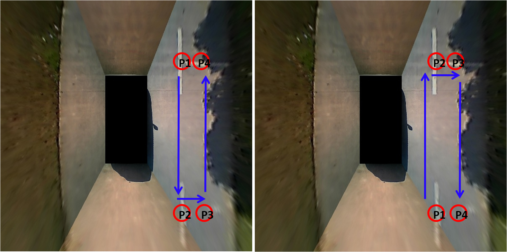
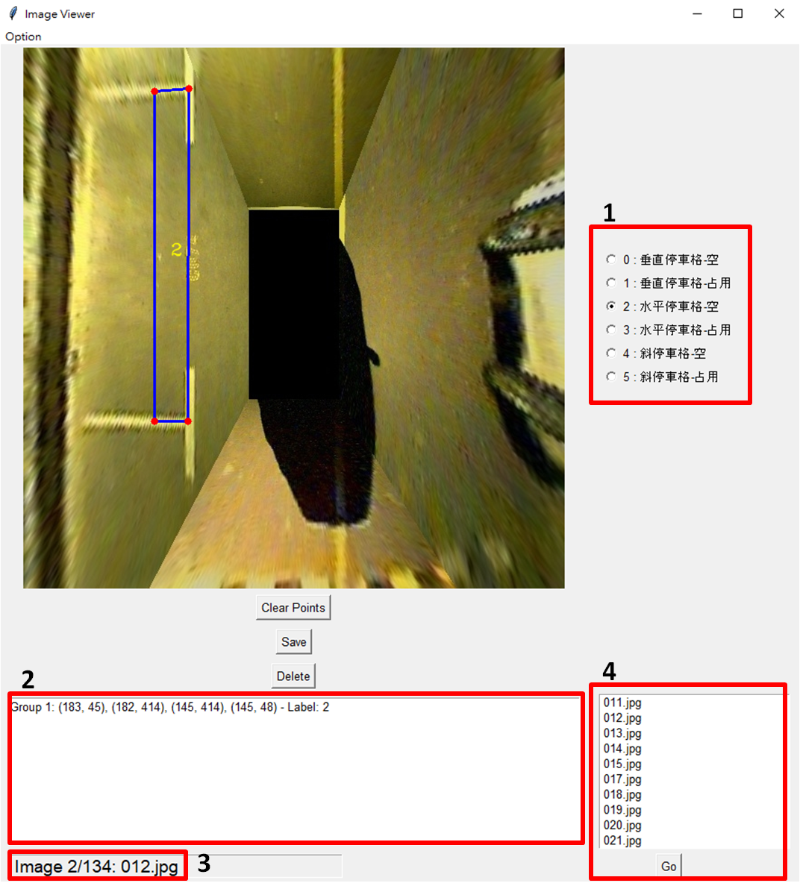

# Parking Slot Mark Tool

<!-- -->

https://github.com/user-attachments/assets/8fe7b55f-0fa4-4076-b238-f3d1d3cd8608

## Introduction
This is python GUI tool for marking parking lot point. Based on: [MarkToolForParkingLotPoint](https://github.com/Teoge/MarkToolForParkingLotPoint)

## Requirements
### Dependencies
* Python 3.5+
* tkinter
* Pillow
* Opencv

## How To Use
### 1. Prepare & Read images
Place all images in a folder.
  1. Click **"Open folder"** in the **"Option"** in the upper right corner of the interface.
  2. If each image has its corresponding json file, it will load automatically.

### 2. Mark Parking Slots
Each slot need **4 points**, and the following images shows an example of the order of the markers.
  1. Click **left mouse** button once to mark the location junction points, such as **P1** and **P2**.
  2. Clockwise or counter-clockwise is fine, but note that **the junction points must be clicked first**.

  
  3. Select the category of the parking slots by clicking on the options on the right side of the interface.
  4. Click **"Save"** button save the parking slots to JSON file.

### 3. Advanced Functionality
  1. Use **"A"** and **"D"** on the keyboard to navigate through the images.
  2. Click **"Clear Points"** button clear all the parking slots on the image.
  3. Click **"Delete"** button delete the image and its corresponding json file.
  4. Click **"Auto save"** in the **"Option"**, and it will save to JSON file automatically.
  5. When you not finish clicking on the 4 points of parking slot, click **mouse wheel** button to delete the point, but note that move the mouse on the point.
  6. When you're finish clicking on the 4 points of parking slot, click **right mouse** button to delete the slot, but note that move  the mouse inside the the slot.

### 4. Interface Introduction
  1. Parking slots are divided into **6** categories:
     * vertical parking slot-free
     * vertical parking slot-occupied
     * parallel parking slot-free
     * parallel parking slot-occupied
     * slanted parking slot-free
     * slanted parking slot-occupied
  2. List all the solts you marked with its coordinates and category.
  3. Show the number of the images in folder and current image number and name.
  4. List all the image, select one of them and click **Go** button, jump to the image you selected.

## Contact
Please feel free to contact me <!-- on my Email：[myworkac38610@gmail.com](mailto:myworkac38610@gmail.com)-->

<!-- * Follow me on [Linkedin profile](http://www.linkedin.com/in/joe66-zheng) and [github page](https://github.com/qwe12345113). -->

